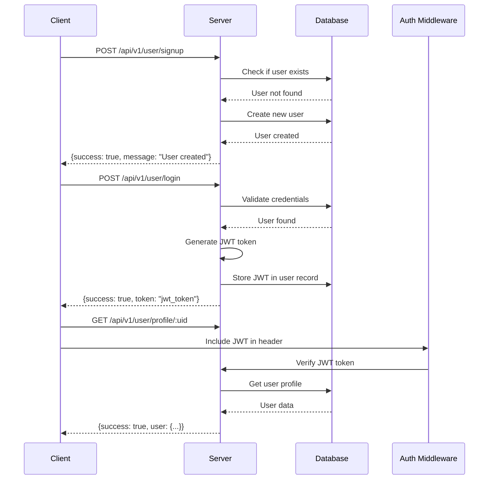
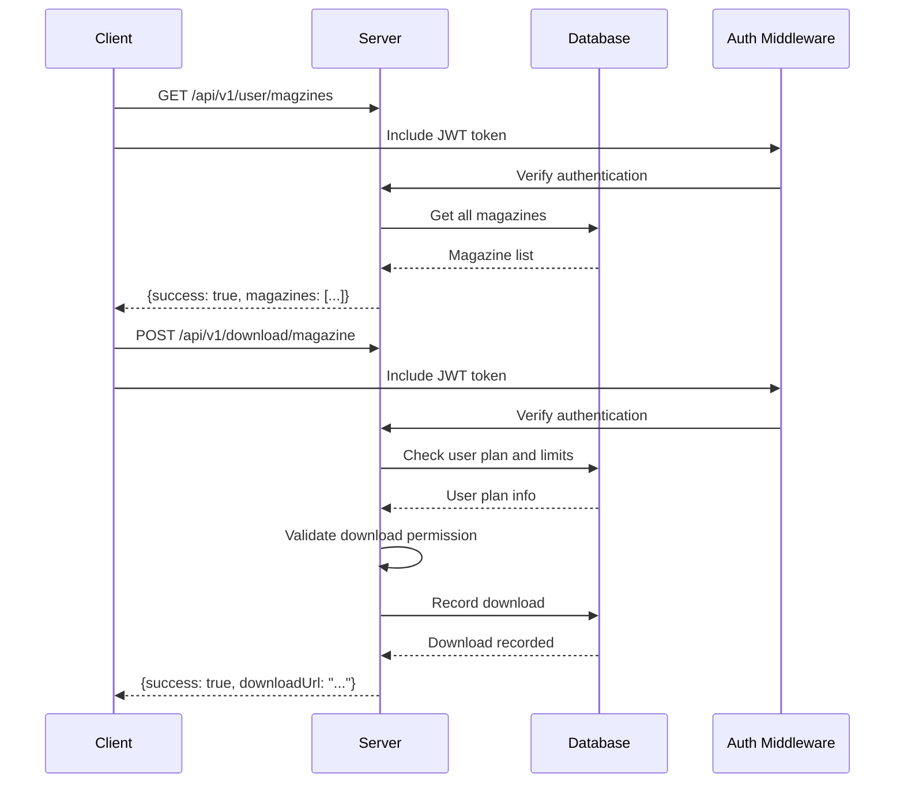
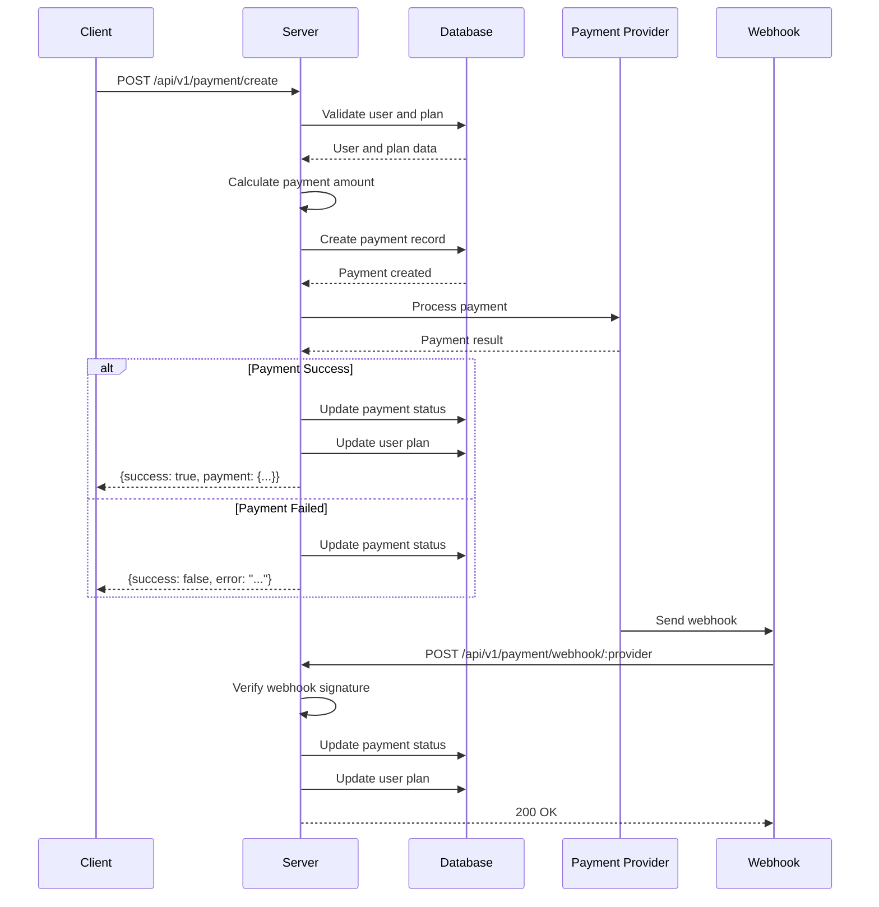
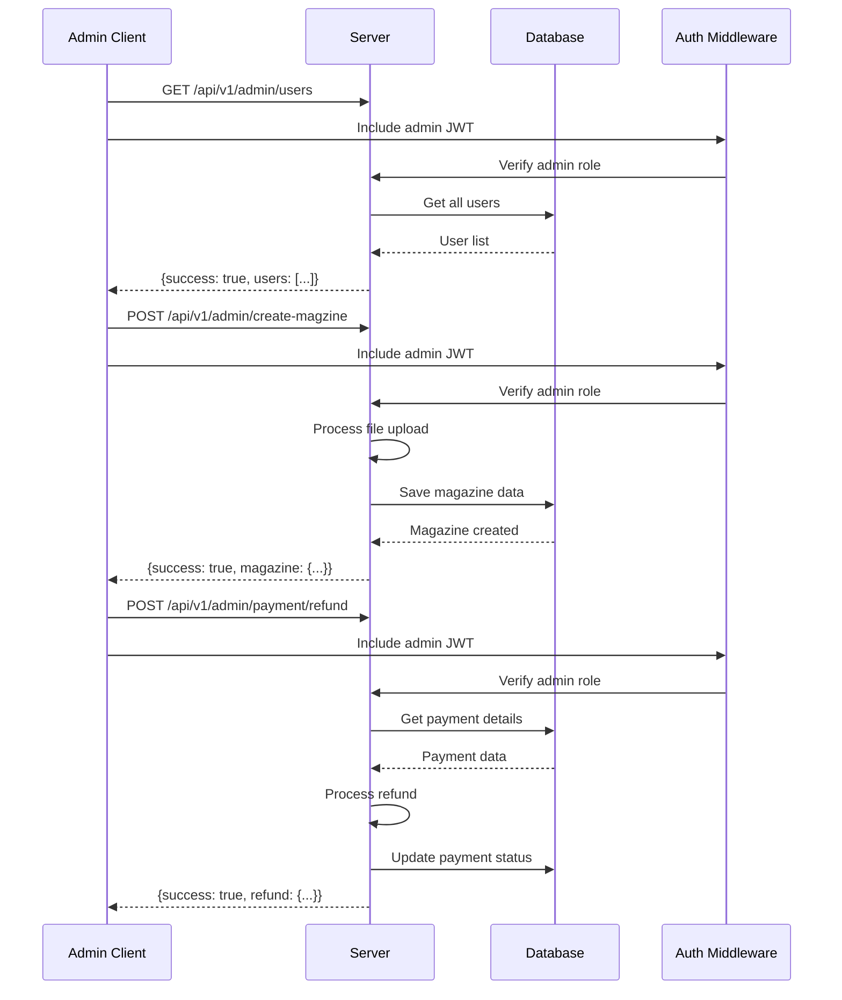
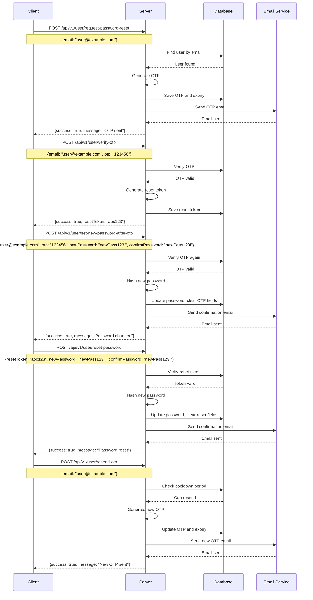
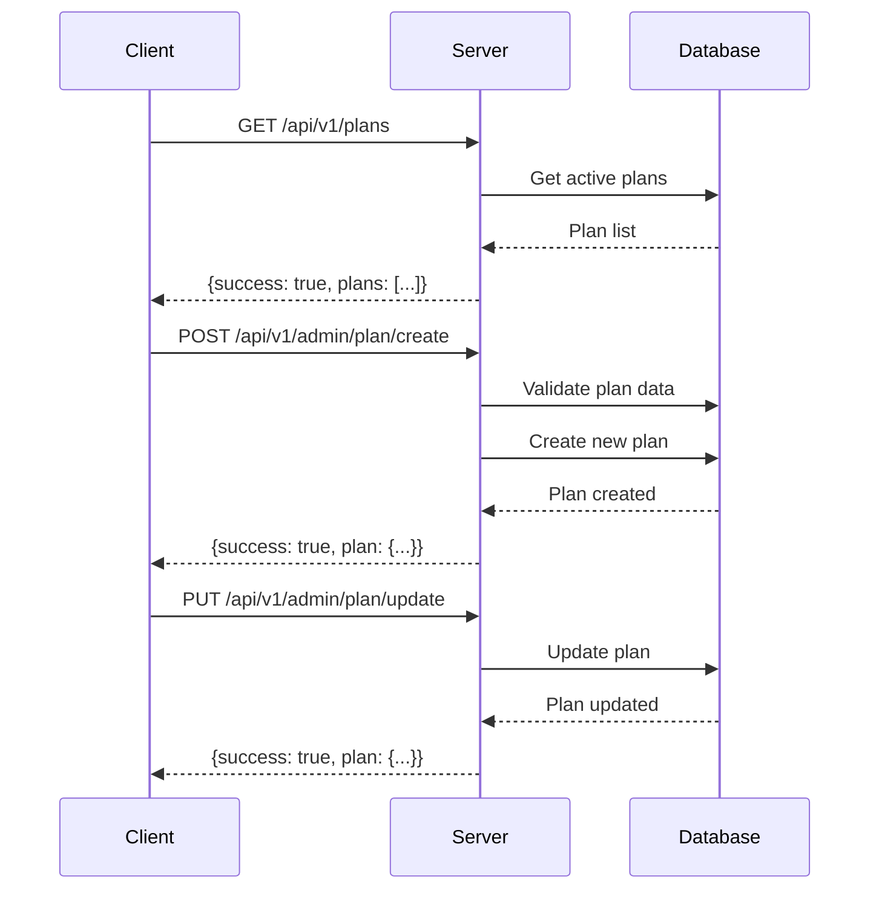

# EchoReads API Flow Diagram

## 🔄 Complete API Request/Response Flow

### 1. User Authentication Flow



### 2. Magazine Access Flow



### 3. Payment Processing Flow



### 4. Admin Management Flow



### 5. Password Reset Flow



### 6. Plan Management Flow



## 📊 Detailed Request/Response Examples

### User Registration
```http
POST /api/v1/user/signup
Content-Type: application/json

{
  "username": "john_doe",
  "email": "john@example.com",
  "password": "securepassword123",
  "name": "John Doe"
}
```

**Response:**
```json
{
  "success": true,
  "message": "User created successfully",
  "user": {
    "uid": 12345,
    "username": "john_doe",
    "email": "john@example.com",
    "plan": "free",
    "createdAt": "2024-01-01T00:00:00Z"
  }
}
```

### User Login
```http
POST /api/v1/user/login
Content-Type: application/json

{
  "email": "john@example.com",
  "password": "securepassword123"
}
```

**Response:**
```json
{
  "success": true,
  "message": "Login successful",
  "token": "eyJhbGciOiJIUzI1NiIsInR5cCI6IkpXVCJ9...",
  "user": {
    "uid": 12345,
    "username": "john_doe",
    "email": "john@example.com",
    "plan": "free",
    "planExpiry": null
  }
}
```

### Create Payment
```http
POST /api/v1/payment/create
Authorization: Bearer <jwt_token>
Content-Type: application/json

{
  "userId": 12345,
  "planId": "507f1f77bcf86cd799439011",
  "paymentMethod": "card",
  "provider": "stripe",
  "amount": 29.99,
  "currency": "USD",
  "billingDetails": {
    "name": "John Doe",
    "email": "john@example.com",
    "address": {
      "line1": "123 Main St",
      "city": "New York",
      "state": "NY",
      "postalCode": "10001",
      "country": "US"
    }
  }
}
```

**Response:**
```json
{
  "success": true,
  "message": "Payment processed successfully",
  "payment": {
    "paymentId": "PAY_1704067200000_abc123def",
    "amount": 29.99,
    "status": "completed",
    "planType": "echopro",
    "planDuration": 1
  }
}
```

### Get User Payments
```http
GET /api/v1/payment/user/12345?page=1&limit=10
Authorization: Bearer <jwt_token>
```

**Response:**
```json
{
  "success": true,
  "user": {
    "uid": 12345,
    "username": "john_doe",
    "email": "john@example.com",
    "currentPlan": "echopro",
    "planExpiry": "2024-02-01T00:00:00Z"
  },
  "payments": [
    {
      "paymentId": "PAY_1704067200000_abc123def",
      "amount": 29.99,
      "currency": "USD",
      "status": "completed",
      "paymentMethod": "card",
      "provider": "stripe",
      "planType": "echopro",
      "createdAt": "2024-01-01T00:00:00Z",
      "completedAt": "2024-01-01T00:00:01Z"
    }
  ],
  "pagination": {
    "currentPage": 1,
    "totalPages": 1,
    "totalPayments": 1,
    "hasNextPage": false,
    "hasPrevPage": false
  },
  "statistics": {
    "totalSpent": 29.99,
    "paymentStats": {
      "completed": {
        "count": 1,
        "totalAmount": 29.99
      }
    }
  }
}
```

### Download Magazine
```http
POST /api/v1/download/magazine
Authorization: Bearer <jwt_token>
Content-Type: application/json

{
  "userId": 12345,
  "magazineId": "507f1f77bcf86cd799439012"
}
```

**Response:**
```json
{
  "success": true,
  "message": "Download initiated",
  "download": {
    "downloadId": "DL_1704067200000_xyz789",
    "magazineId": "507f1f77bcf86cd799439012",
    "downloadUrl": "https://cdn.echoreads.com/magazines/issue_123.pdf",
    "expiresAt": "2024-01-01T01:00:00Z"
  }
}
```

### Admin Payment History
```http
POST /api/v1/admin/payment-history
Authorization: Bearer <admin_jwt_token>
Content-Type: application/json

{
  "adminUid": 1
}
```

**Response:**
```json
{
  "success": true,
  "revenueStats": {
    "totalRevenue": 299.90,
    "monthlyRevenue": 29.99,
    "yearlyRevenue": 29.99,
    "averageRevenuePerUser": 29.99
  },
  "subscriptionStats": {
    "totalPaidUsers": 10,
    "activeSubscriptions": 8,
    "expiredSubscriptions": 2,
    "planBreakdown": {
      "echopro": {
        "count": 6,
        "revenue": 179.94
      },
      "echoproplus": {
        "count": 4,
        "revenue": 119.96
      }
    }
  },
  "userList": [
    {
      "uid": 12345,
      "username": "john_doe",
      "email": "john@example.com",
      "plan": "echopro",
      "planPrice": 29.99,
      "planStart": "2024-01-01T00:00:00Z",
      "planExpiry": "2024-02-01T00:00:00Z",
      "isActive": true,
      "revenue": 29.99
    }
  ]
}
```

## 🔄 Error Handling Flow

### Validation Error
```http
POST /api/v1/user/signup
Content-Type: application/json

{
  "username": "john",
  "email": "invalid-email"
}
```

**Response:**
```json
{
  "success": false,
  "message": "Validation failed",
  "errors": [
    {
      "field": "email",
      "message": "Invalid email format"
    },
    {
      "field": "username",
      "message": "Username must be at least 5 characters"
    }
  ]
}
```

### Authentication Error
```http
GET /api/v1/user/profile/12345
```

**Response:**
```json
{
  "success": false,
  "message": "Authentication required",
  "error": "No token provided"
}
```

### Authorization Error
```http
GET /api/v1/admin/users
Authorization: Bearer <user_jwt_token>
```

**Response:**
```json
{
  "success": false,
  "message": "Admin access required",
  "error": "Insufficient permissions"
}
```

### Resource Not Found
```http
GET /api/v1/user/profile/99999
Authorization: Bearer <jwt_token>
```

**Response:**
```json
{
  "success": false,
  "message": "User not found",
  "error": "No user found with uid: 99999"
}
```

## 📈 Performance Optimization Flow

### Database Query Optimization
```
1. Use indexes on frequently queried fields
2. Implement pagination for large datasets
3. Use aggregation pipelines for analytics
4. Cache frequently accessed data
5. Optimize database connections
```

### API Response Optimization
```
1. Compress responses using gzip
2. Implement response caching
3. Use pagination for large lists
4. Optimize JSON serialization
5. Implement rate limiting
```

This comprehensive API flow diagram shows the exact request/response patterns for all major features in your EchoReads backend system. 