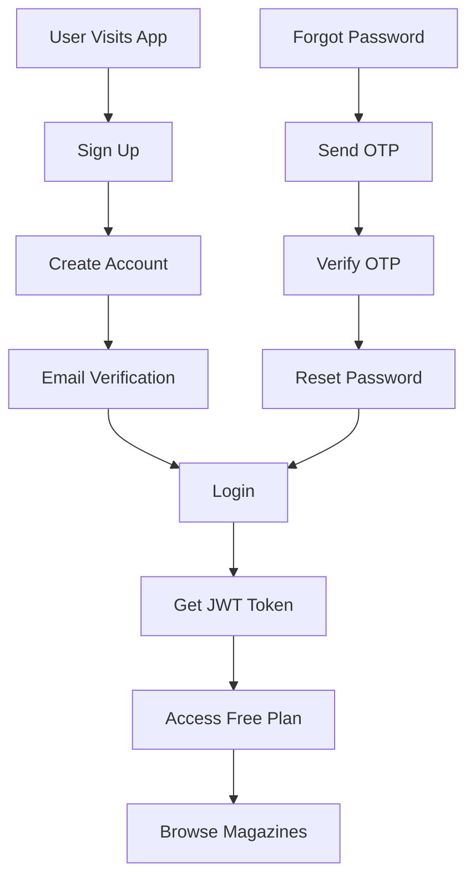
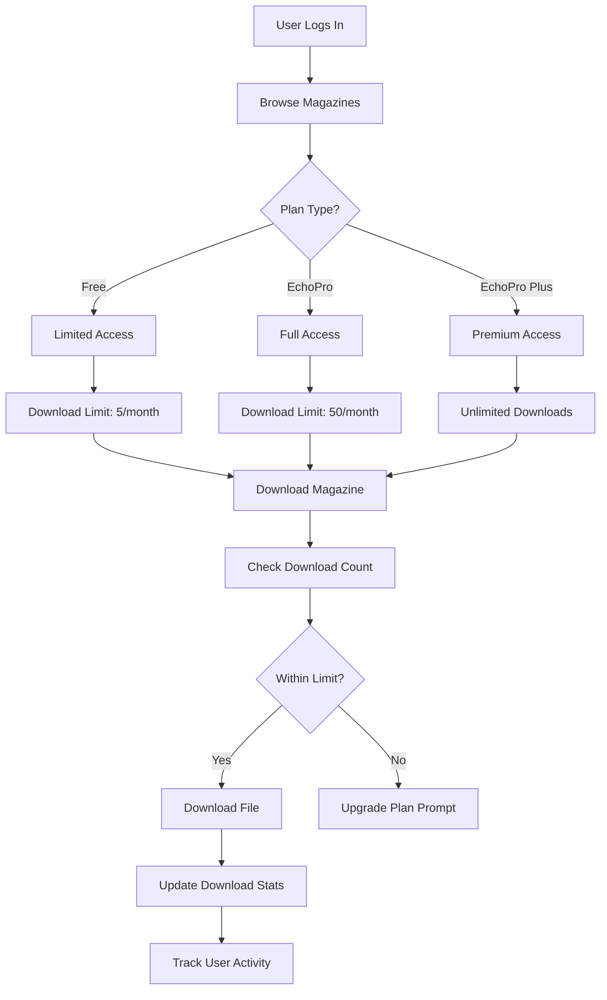
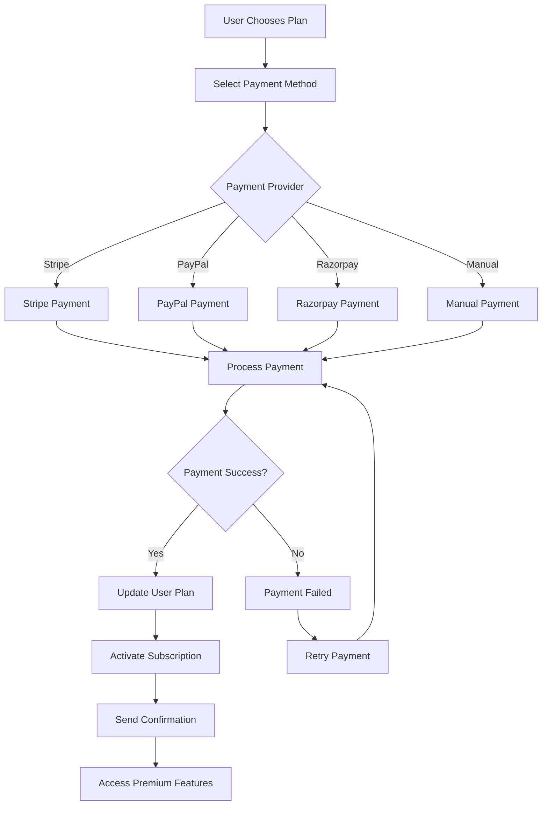
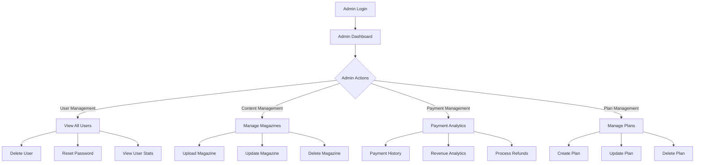

# EchoReads Backend - Complete Flow Structure

## 🏗️ System Architecture Overview

```
┌─────────────────┐    ┌─────────────────┐    ┌─────────────────┐
│   Frontend      │    │   Mobile App    │    │   Admin Panel   │
│   (React/Vue)   │    │   (React Native)│    │   (Dashboard)   │
└─────────┬───────┘    └─────────┬───────┘    └─────────┬───────┘
          │                      │                      │
          └──────────────────────┼──────────────────────┘
                                 │
                    ┌─────────────▼─────────────┐
                    │    Express.js Server      │
                    │   (API Gateway/Router)   │
                    └─────────────┬─────────────┘
                                  │
                    ┌─────────────▼─────────────┐
                    │      MongoDB Database     │
                    │   (User Data & Content)  │
                    └───────────────────────────┘
```

## 🔄 Complete User Journey Flow

### 1. User Registration & Authentication Flow



### 2. Magazine Access & Download Flow



### 3. Payment & Subscription Flow



### 4. Admin Management Flow



## 📊 Data Flow Architecture

### User Data Flow
```
User Input → Validation → Database → Response → Frontend
```

### Payment Data Flow
```
Payment Request → Provider API → Webhook → Database → User Update
```

### Magazine Download Flow
```
Download Request → Auth Check → Plan Check → File Serve → Stats Update
```

## 🔐 Authentication & Authorization Flow

### JWT Token Flow
```
Login → Validate Credentials → Generate JWT → Store in DB → Return Token
```

### Request Authorization
```
Request → Extract Token → Verify JWT → Check Permissions → Process Request
```

### Admin Authorization
```
Admin Request → Verify Admin Role → Check Permissions → Execute Action
```

## 💳 Payment Processing Flow

### Payment Creation
```
1. User selects plan
2. Choose payment method
3. Enter billing details
4. Process payment
5. Update user plan
6. Send confirmation
```

### Payment Webhook Processing
```
1. Provider sends webhook
2. Verify signature
3. Update payment status
4. Update user plan
5. Send notifications
```

### Refund Processing
```
1. Admin initiates refund
2. Process with provider
3. Update payment record
4. Adjust user plan
5. Send refund confirmation
```

## 📱 API Endpoint Structure

### Authentication Endpoints
```
POST /api/v1/user/signup
POST /api/v1/user/login
POST /api/v1/user/reset-password
POST /api/v1/user/new-password
```

### User Profile Endpoints
```
GET /api/v1/user/profile/:uid
PUT /api/v1/user/update-data
```

### Magazine Endpoints
```
GET /api/v1/user/magzines
POST /api/v1/admin/create-magzine
PUT /api/v1/admin/update-magzine
DELETE /api/v1/admin/delete-magzine
```

### Download Endpoints
```
POST /api/v1/download/magazine
GET /api/v1/download/history/:uid
POST /api/v1/admin/download-stats
```

### Payment Endpoints
```
POST /api/v1/payment/create
GET /api/v1/payment/user/:userId
POST /api/v1/admin/payment/refund
POST /api/v1/payment/webhook/:provider
```

### Plan Management Endpoints
```
GET /api/v1/plans
POST /api/v1/admin/plan/create
PUT /api/v1/admin/plan/update
DELETE /api/v1/admin/plan/delete
```

### Admin Endpoints
```
GET /api/v1/admin/users
DELETE /api/v1/admin/delete-user
POST /api/v1/admin/reset-password
POST /api/v1/admin/payment-history
POST /api/v1/admin/revenue-analytics
```

## 🔄 Auto Plan Management Flow

### Expiry Check Process
```
1. Daily scheduler runs
2. Check expired plans
3. Update user status
4. Send expiry notifications
5. Update database
```

### Subscription Renewal
```
1. Check expiring plans
2. Send renewal reminders
3. Process auto-renewal
4. Update subscription
5. Send confirmation
```

## 📈 Analytics & Reporting Flow

### Revenue Analytics
```
1. Collect payment data
2. Calculate metrics
3. Generate reports
4. Send to admin
5. Store analytics
```

### User Analytics
```
1. Track user activity
2. Monitor downloads
3. Analyze usage patterns
4. Generate insights
5. Update dashboard
```

## 🛡️ Security Flow

### Data Protection
```
1. Input validation
2. SQL injection prevention
3. XSS protection
4. CSRF protection
5. Rate limiting
```

### Payment Security
```
1. PCI compliance
2. Tokenization
3. Encryption
4. Fraud detection
5. Audit logging
```

## 🔧 Error Handling Flow

### Error Response Structure
```
{
  "success": false,
  "message": "Error description",
  "error": "Technical details",
  "timestamp": "2024-01-01T00:00:00Z"
}
```

### Error Categories
- **400**: Bad Request (validation errors)
- **401**: Unauthorized (authentication)
- **403**: Forbidden (authorization)
- **404**: Not Found (resource not found)
- **500**: Internal Server Error (server issues)

## 📊 Database Schema Relationships

### Core Entities
```
User (Account) ←→ Payment
User (Account) ←→ Download
User (Account) ←→ Magazine
Plan ←→ Payment
Plan ←→ User
```

### Data Flow
```
1. User creates account
2. User selects plan
3. User makes payment
4. User downloads magazines
5. System tracks activity
6. Admin manages content
```

## 🚀 Deployment Flow

### Development → Production
```
1. Code development
2. Testing
3. Staging deployment
4. Production deployment
5. Monitoring
6. Maintenance
```

### Database Migration
```
1. Schema changes
2. Data migration
3. Index optimization
4. Performance tuning
5. Backup strategy
```

This complete flow structure provides a comprehensive overview of how all components in your EchoReads backend work together to create a seamless user experience. 